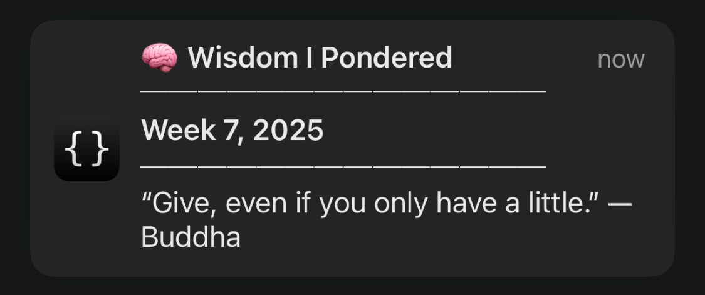
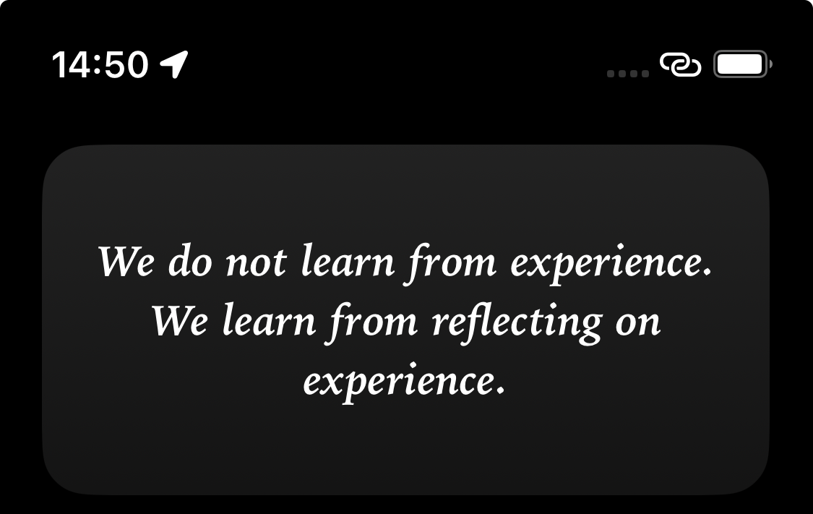
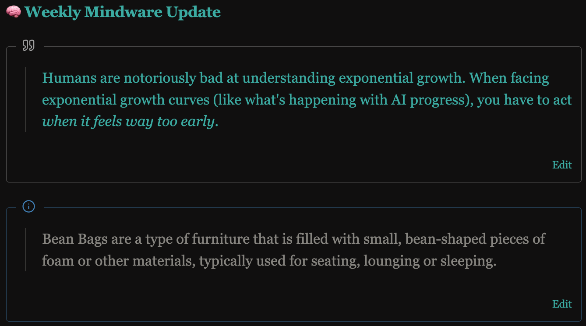

# Weekly Mindware Update

## About

This repository is a weekly dump of ten ideas that spark my curiosity and expand my mind.

The sources are diverse, often captured while I'm reading or having a conversation with people.

You can browse all issues at [huami.ng/wmu](https://huami.ng/wmu). If you find this project valuable, please consider supporting my work by [buying me a coffee](https://buymeacoffee.com/huaming.huang).

## Why I Built This Project

> _“Nearly everything is really interesting if you go into it deeply enough.” — Richard Feynman_

> _“Remember to look up at the stars and not down at your feet. Try to make sense of what you see and wonder about what makes the universe exist. Be curious.” — Stephen Hawking_

> _“Take the attitude of a student. Never be too big to ask questions. Never know too much to learn something new.” — Og Mandino_

We don't know what we don't know, the unknown unknowns.

I believe that the only way to touch the boundary of unknown unknowns is staying curious and taking the attitude of a student all the time.

## Tools

To help you get the most out of this repository, I developed the following tools:

### 1. [Apple Shortcut](https://shortcutomation.com/gallery/shared/weekly-mindware-update/)

<a href="assets/notification.png">
<kbd>

</kbd>
</a>

### 2. [Scriptable Widget](https://github.com/huaminghuangtw/Scriptable/blob/main/widget_quote-from-Weekly-Mindware-Update.js)

<a href="assets/widget.png">
<kbd>

</kbd>
</a>

> [!TIP]
> _[Check out](https://github.com/huaminghuangtw/Scriptable) my other repository for customizable notifications and widgets created with [Scriptable](https://scriptable.app)!_

### 3. [Obsidian Callout](https://github.com/huaminghuangtw/Second-Brain/blob/main/Homepage.md#-weekly-mindware-update)

<a href="https://github.com/huaminghuangtw/Second-Brain/blob/main/Homepage.md#-weekly-mindware-update">
<kbd>

</kbd>
</a>

## Archive

<!-- INDEX-START -->

<strong><a href=".">All Issues (83)</a></strong>

- 

    

      <strong>
        <a href="issues/2025">2025 (31)</a>
      </strong>
    

    - <a href="issues/2025/2025_Week_31.md">#83 - Week 31, 2025</a>
    - <a href="issues/2025/2025_Week_30.md">#82 - Week 30, 2025</a>
    - <a href="issues/2025/2025_Week_29.md">#81 - Week 29, 2025</a>
    - <a href="issues/2025/2025_Week_28.md">#80 - Week 28, 2025</a>
    - <a href="issues/2025/2025_Week_27.md">#79 - Week 27, 2025</a>
    - <a href="issues/2025/2025_Week_26.md">#78 - Week 26, 2025</a>
    - <a href="issues/2025/2025_Week_25.md">#77 - Week 25, 2025</a>
    - <a href="issues/2025/2025_Week_24.md">#76 - Week 24, 2025</a>
    - <a href="issues/2025/2025_Week_23.md">#75 - Week 23, 2025</a>
    - <a href="issues/2025/2025_Week_22.md">#74 - Week 22, 2025</a>
    - <a href="issues/2025/2025_Week_21.md">#73 - Week 21, 2025</a>
    - <a href="issues/2025/2025_Week_20.md">#72 - Week 20, 2025</a>
    - <a href="issues/2025/2025_Week_19.md">#71 - Week 19, 2025</a>
    - <a href="issues/2025/2025_Week_18.md">#70 - Week 18, 2025</a>
    - <a href="issues/2025/2025_Week_17.md">#69 - Week 17, 2025</a>
    - <a href="issues/2025/2025_Week_16.md">#68 - Week 16, 2025</a>
    - <a href="issues/2025/2025_Week_15.md">#67 - Week 15, 2025</a>
    - <a href="issues/2025/2025_Week_14.md">#66 - Week 14, 2025</a>
    - <a href="issues/2025/2025_Week_13.md">#65 - Week 13, 2025</a>
    - <a href="issues/2025/2025_Week_12.md">#64 - Week 12, 2025</a>
    - <a href="issues/2025/2025_Week_11.md">#63 - Week 11, 2025</a>
    - <a href="issues/2025/2025_Week_10.md">#62 - Week 10, 2025</a>
    - <a href="issues/2025/2025_Week_09.md">#61 - Week 9, 2025</a>
    - <a href="issues/2025/2025_Week_08.md">#60 - Week 8, 2025</a>
    - <a href="issues/2025/2025_Week_07.md">#59 - Week 7, 2025</a>
    - <a href="issues/2025/2025_Week_06.md">#58 - Week 6, 2025</a>
    - <a href="issues/2025/2025_Week_05.md">#57 - Week 5, 2025</a>
    - <a href="issues/2025/2025_Week_04.md">#56 - Week 4, 2025</a>
    - <a href="issues/2025/2025_Week_03.md">#55 - Week 3, 2025</a>
    - <a href="issues/2025/2025_Week_02.md">#54 - Week 2, 2025</a>
    - <a href="issues/2025/2025_Week_01.md">#53 - Week 1, 2025</a>
  

- 

    

      <strong>
        <a href="issues/2024">2024 (52)</a>
      </strong>
    

    - <a href="issues/2024/2024_Week_52.md">#52 - Week 52, 2024</a>
    - <a href="issues/2024/2024_Week_51.md">#51 - Week 51, 2024</a>
    - <a href="issues/2024/2024_Week_50.md">#50 - Week 50, 2024</a>
    - <a href="issues/2024/2024_Week_49.md">#49 - Week 49, 2024</a>
    - <a href="issues/2024/2024_Week_48.md">#48 - Week 48, 2024</a>
    - <a href="issues/2024/2024_Week_47.md">#47 - Week 47, 2024</a>
    - <a href="issues/2024/2024_Week_46.md">#46 - Week 46, 2024</a>
    - <a href="issues/2024/2024_Week_45.md">#45 - Week 45, 2024</a>
    - <a href="issues/2024/2024_Week_44.md">#44 - Week 44, 2024</a>
    - <a href="issues/2024/2024_Week_43.md">#43 - Week 43, 2024</a>
    - <a href="issues/2024/2024_Week_42.md">#42 - Week 42, 2024</a>
    - <a href="issues/2024/2024_Week_41.md">#41 - Week 41, 2024</a>
    - <a href="issues/2024/2024_Week_40.md">#40 - Week 40, 2024</a>
    - <a href="issues/2024/2024_Week_39.md">#39 - Week 39, 2024</a>
    - <a href="issues/2024/2024_Week_38.md">#38 - Week 38, 2024</a>
    - <a href="issues/2024/2024_Week_37.md">#37 - Week 37, 2024</a>
    - <a href="issues/2024/2024_Week_36.md">#36 - Week 36, 2024</a>
    - <a href="issues/2024/2024_Week_35.md">#35 - Week 35, 2024</a>
    - <a href="issues/2024/2024_Week_34.md">#34 - Week 34, 2024</a>
    - <a href="issues/2024/2024_Week_33.md">#33 - Week 33, 2024</a>
    - <a href="issues/2024/2024_Week_32.md">#32 - Week 32, 2024</a>
    - <a href="issues/2024/2024_Week_31.md">#31 - Week 31, 2024</a>
    - <a href="issues/2024/2024_Week_30.md">#30 - Week 30, 2024</a>
    - <a href="issues/2024/2024_Week_29.md">#29 - Week 29, 2024</a>
    - <a href="issues/2024/2024_Week_28.md">#28 - Week 28, 2024</a>
    - <a href="issues/2024/2024_Week_27.md">#27 - Week 27, 2024</a>
    - <a href="issues/2024/2024_Week_26.md">#26 - Week 26, 2024</a>
    - <a href="issues/2024/2024_Week_25.md">#25 - Week 25, 2024</a>
    - <a href="issues/2024/2024_Week_24.md">#24 - Week 24, 2024</a>
    - <a href="issues/2024/2024_Week_23.md">#23 - Week 23, 2024</a>
    - <a href="issues/2024/2024_Week_22.md">#22 - Week 22, 2024</a>
    - <a href="issues/2024/2024_Week_21.md">#21 - Week 21, 2024</a>
    - <a href="issues/2024/2024_Week_20.md">#20 - Week 20, 2024</a>
    - <a href="issues/2024/2024_Week_19.md">#19 - Week 19, 2024</a>
    - <a href="issues/2024/2024_Week_18.md">#18 - Week 18, 2024</a>
    - <a href="issues/2024/2024_Week_17.md">#17 - Week 17, 2024</a>
    - <a href="issues/2024/2024_Week_16.md">#16 - Week 16, 2024</a>
    - <a href="issues/2024/2024_Week_15.md">#15 - Week 15, 2024</a>
    - <a href="issues/2024/2024_Week_14.md">#14 - Week 14, 2024</a>
    - <a href="issues/2024/2024_Week_13.md">#13 - Week 13, 2024</a>
    - <a href="issues/2024/2024_Week_12.md">#12 - Week 12, 2024</a>
    - <a href="issues/2024/2024_Week_11.md">#11 - Week 11, 2024</a>
    - <a href="issues/2024/2024_Week_10.md">#10 - Week 10, 2024</a>
    - <a href="issues/2024/2024_Week_09.md">#9 - Week 9, 2024</a>
    - <a href="issues/2024/2024_Week_08.md">#8 - Week 8, 2024</a>
    - <a href="issues/2024/2024_Week_07.md">#7 - Week 7, 2024</a>
    - <a href="issues/2024/2024_Week_06.md">#6 - Week 6, 2024</a>
    - <a href="issues/2024/2024_Week_05.md">#5 - Week 5, 2024</a>
    - <a href="issues/2024/2024_Week_04.md">#4 - Week 4, 2024</a>
    - <a href="issues/2024/2024_Week_03.md">#3 - Week 3, 2024</a>
    - <a href="issues/2024/2024_Week_02.md">#2 - Week 2, 2024</a>
    - <a href="issues/2024/2024_Week_01.md">#1 - Week 1, 2024</a>
  

<!-- INDEX-END -->

## Contribution

Contributions are welcome! Please [open an issue](https://github.com/huaminghuangtw/Weekly-Mindware-Update/issues/new) or [submit a pull request](https://github.com/huaminghuangtw/Weekly-Mindware-Update/compare).
