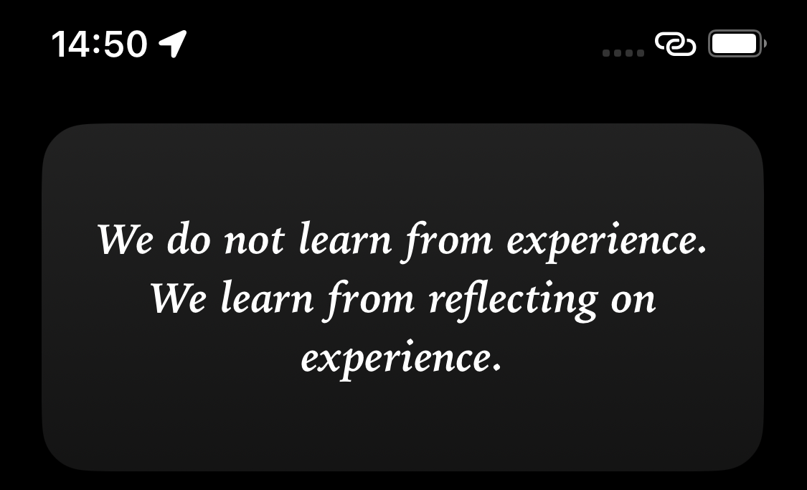

# Weekly Mindware Update

> _“Remember to look up at the stars and not down at your feet. Try to make sense of what you see and wonder about what makes the universe exist. Be curious.” — Stephen Hawking_

## About

This repository is a weekly dump of ten ideas that spark my curiosity and expand my mind. The sources are diverse, often captured while I’m [reading](https://github.com/huaminghuangtw/Brain-Food) or having a conversation with people.

## Why I Built This Project

> _“It ain’t what you don’t know that gets you into trouble. It’s what you know for sure that just ain’t so.” — Mark Twain_

> _“The first principle is that you must not fool yourself — and you are the easiest person to fool.” — Richard Feynman_

I used to be arrogant, thinking I had the world figured out. A fool’s confidence. An [intellectual yet idiot](https://huami.ng/the-intellectual-yet-idiot).

The more I learn, the more I realize that most of my certainties were [totally wrong and deluded](https://fs.blog/david-foster-wallace-this-is-water/). I’ve learned the hard way that, to learn is to be willing to let go of your ego.

So I started this project.

A weekly ritual to practice my humility.

Ten ideas to keep my mind open. To be aware of my ignorance. To admit that I don’t have all the answers.

And a change began.

I learned to [lower my identity](https://paulgraham.com/identity.html), to [assume people were smarter than me](https://sive.rs/below-average), and to enjoy feeling like a beginner.

> _“Nearly everything is really interesting if you go into it deeply enough.” — Richard Feynman_

I believe that, staying curious is the only way to get closer to the frontier of **[unknown unknowns](https://sketchplanations.com/unknown-unknowns)—what we don’t know we don’t know**.

This project is a reminder to myself.

To always be humble.

To always learn with the eyes of a child.

To always be a student, as if to live forever.

## Tools

To help you get the most out of this repository, I developed the following tools:

### 1. [Apple Shortcut](https://shortcutomation.com/weekly-mindware-update/)

<a href="assets/notification.png">
<kbd>

</kbd>
</a>

### 2. [Scriptable Widget](https://github.com/huaminghuangtw/Scriptable/blob/main/widget_quote-from-Weekly-Mindware-Update.js)

<a href="assets/widget.png">
<kbd>

</kbd>
</a>

> [!TIP]
> _[Check out](https://github.com/huaminghuangtw/Scriptable) my other repository for customizable notifications and widgets created with [Scriptable](https://scriptable.app)!_

### 3. [Obsidian Callout](https://github.com/huaminghuangtw/Second-Brain/blob/main/Homepage.md#-weekly-mindware-update)

<a href="assets/callout.png">
<kbd>

</kbd>
</a>

## Archives

<!-- INDEX-START -->

<strong><a href=".">All Issues (101)</a></strong>

* 

    

      <strong>
        <a href="issues/2025">2025 (49)</a>
      </strong>
    

    * <a href="https://huami.ng/2025-week-49">#101 - Week 49, 2025</a>
    * <a href="https://huami.ng/2025-week-48">#100 - Week 48, 2025</a>
    * <a href="https://huami.ng/2025-week-47">#99 - Week 47, 2025</a>
    * <a href="https://huami.ng/2025-week-46">#98 - Week 46, 2025</a>
    * <a href="https://huami.ng/2025-week-45">#97 - Week 45, 2025</a>
    * <a href="https://huami.ng/2025-week-44">#96 - Week 44, 2025</a>
    * <a href="https://huami.ng/2025-week-43">#95 - Week 43, 2025</a>
    * <a href="https://huami.ng/2025-week-42">#94 - Week 42, 2025</a>
    * <a href="https://huami.ng/2025-week-41">#93 - Week 41, 2025</a>
    * <a href="https://huami.ng/2025-week-40">#92 - Week 40, 2025</a>
    * <a href="https://huami.ng/2025-week-39">#91 - Week 39, 2025</a>
    * <a href="https://huami.ng/2025-week-38">#90 - Week 38, 2025</a>
    * <a href="https://huami.ng/2025-week-37">#89 - Week 37, 2025</a>
    * <a href="https://huami.ng/2025-week-36">#88 - Week 36, 2025</a>
    * <a href="https://huami.ng/2025-week-35">#87 - Week 35, 2025</a>
    * <a href="https://huami.ng/2025-week-34">#86 - Week 34, 2025</a>
    * <a href="https://huami.ng/2025-week-33">#85 - Week 33, 2025</a>
    * <a href="https://huami.ng/2025-week-32">#84 - Week 32, 2025</a>
    * <a href="https://huami.ng/2025-week-31">#83 - Week 31, 2025</a>
    * <a href="https://huami.ng/2025-week-30">#82 - Week 30, 2025</a>
    * <a href="https://huami.ng/2025-week-29">#81 - Week 29, 2025</a>
    * <a href="https://huami.ng/2025-week-28">#80 - Week 28, 2025</a>
    * <a href="https://huami.ng/2025-week-27">#79 - Week 27, 2025</a>
    * <a href="https://huami.ng/2025-week-26">#78 - Week 26, 2025</a>
    * <a href="https://huami.ng/2025-week-25">#77 - Week 25, 2025</a>
    * <a href="https://huami.ng/2025-week-24">#76 - Week 24, 2025</a>
    * <a href="https://huami.ng/2025-week-23">#75 - Week 23, 2025</a>
    * <a href="https://huami.ng/2025-week-22">#74 - Week 22, 2025</a>
    * <a href="https://huami.ng/2025-week-21">#73 - Week 21, 2025</a>
    * <a href="https://huami.ng/2025-week-20">#72 - Week 20, 2025</a>
    * <a href="https://huami.ng/2025-week-19">#71 - Week 19, 2025</a>
    * <a href="https://huami.ng/2025-week-18">#70 - Week 18, 2025</a>
    * <a href="https://huami.ng/2025-week-17">#69 - Week 17, 2025</a>
    * <a href="https://huami.ng/2025-week-16">#68 - Week 16, 2025</a>
    * <a href="https://huami.ng/2025-week-15">#67 - Week 15, 2025</a>
    * <a href="https://huami.ng/2025-week-14">#66 - Week 14, 2025</a>
    * <a href="https://huami.ng/2025-week-13">#65 - Week 13, 2025</a>
    * <a href="https://huami.ng/2025-week-12">#64 - Week 12, 2025</a>
    * <a href="https://huami.ng/2025-week-11">#63 - Week 11, 2025</a>
    * <a href="https://huami.ng/2025-week-10">#62 - Week 10, 2025</a>
    * <a href="https://huami.ng/2025-week-9">#61 - Week 9, 2025</a>
    * <a href="https://huami.ng/2025-week-8">#60 - Week 8, 2025</a>
    * <a href="https://huami.ng/2025-week-7">#59 - Week 7, 2025</a>
    * <a href="https://huami.ng/2025-week-6">#58 - Week 6, 2025</a>
    * <a href="https://huami.ng/2025-week-5">#57 - Week 5, 2025</a>
    * <a href="https://huami.ng/2025-week-4">#56 - Week 4, 2025</a>
    * <a href="https://huami.ng/2025-week-3">#55 - Week 3, 2025</a>
    * <a href="https://huami.ng/2025-week-2">#54 - Week 2, 2025</a>
    * <a href="https://huami.ng/2025-week-1">#53 - Week 1, 2025</a>
  

* 

    

      <strong>
        <a href="issues/2024">2024 (52)</a>
      </strong>
    

    * <a href="https://huami.ng/2024-week-52">#52 - Week 52, 2024</a>
    * <a href="https://huami.ng/2024-week-51">#51 - Week 51, 2024</a>
    * <a href="https://huami.ng/2024-week-50">#50 - Week 50, 2024</a>
    * <a href="https://huami.ng/2024-week-49">#49 - Week 49, 2024</a>
    * <a href="https://huami.ng/2024-week-48">#48 - Week 48, 2024</a>
    * <a href="https://huami.ng/2024-week-47">#47 - Week 47, 2024</a>
    * <a href="https://huami.ng/2024-week-46">#46 - Week 46, 2024</a>
    * <a href="https://huami.ng/2024-week-45">#45 - Week 45, 2024</a>
    * <a href="https://huami.ng/2024-week-44">#44 - Week 44, 2024</a>
    * <a href="https://huami.ng/2024-week-43">#43 - Week 43, 2024</a>
    * <a href="https://huami.ng/2024-week-42">#42 - Week 42, 2024</a>
    * <a href="https://huami.ng/2024-week-41">#41 - Week 41, 2024</a>
    * <a href="https://huami.ng/2024-week-40">#40 - Week 40, 2024</a>
    * <a href="https://huami.ng/2024-week-39">#39 - Week 39, 2024</a>
    * <a href="https://huami.ng/2024-week-38">#38 - Week 38, 2024</a>
    * <a href="https://huami.ng/2024-week-37">#37 - Week 37, 2024</a>
    * <a href="https://huami.ng/2024-week-36">#36 - Week 36, 2024</a>
    * <a href="https://huami.ng/2024-week-35">#35 - Week 35, 2024</a>
    * <a href="https://huami.ng/2024-week-34">#34 - Week 34, 2024</a>
    * <a href="https://huami.ng/2024-week-33">#33 - Week 33, 2024</a>
    * <a href="https://huami.ng/2024-week-32">#32 - Week 32, 2024</a>
    * <a href="https://huami.ng/2024-week-31">#31 - Week 31, 2024</a>
    * <a href="https://huami.ng/2024-week-30">#30 - Week 30, 2024</a>
    * <a href="https://huami.ng/2024-week-29">#29 - Week 29, 2024</a>
    * <a href="https://huami.ng/2024-week-28">#28 - Week 28, 2024</a>
    * <a href="https://huami.ng/2024-week-27">#27 - Week 27, 2024</a>
    * <a href="https://huami.ng/2024-week-26">#26 - Week 26, 2024</a>
    * <a href="https://huami.ng/2024-week-25">#25 - Week 25, 2024</a>
    * <a href="https://huami.ng/2024-week-24">#24 - Week 24, 2024</a>
    * <a href="https://huami.ng/2024-week-23">#23 - Week 23, 2024</a>
    * <a href="https://huami.ng/2024-week-22">#22 - Week 22, 2024</a>
    * <a href="https://huami.ng/2024-week-21">#21 - Week 21, 2024</a>
    * <a href="https://huami.ng/2024-week-20">#20 - Week 20, 2024</a>
    * <a href="https://huami.ng/2024-week-19">#19 - Week 19, 2024</a>
    * <a href="https://huami.ng/2024-week-18">#18 - Week 18, 2024</a>
    * <a href="https://huami.ng/2024-week-17">#17 - Week 17, 2024</a>
    * <a href="https://huami.ng/2024-week-16">#16 - Week 16, 2024</a>
    * <a href="https://huami.ng/2024-week-15">#15 - Week 15, 2024</a>
    * <a href="https://huami.ng/2024-week-14">#14 - Week 14, 2024</a>
    * <a href="https://huami.ng/2024-week-13">#13 - Week 13, 2024</a>
    * <a href="https://huami.ng/2024-week-12">#12 - Week 12, 2024</a>
    * <a href="https://huami.ng/2024-week-11">#11 - Week 11, 2024</a>
    * <a href="https://huami.ng/2024-week-10">#10 - Week 10, 2024</a>
    * <a href="https://huami.ng/2024-week-9">#9 - Week 9, 2024</a>
    * <a href="https://huami.ng/2024-week-8">#8 - Week 8, 2024</a>
    * <a href="https://huami.ng/2024-week-7">#7 - Week 7, 2024</a>
    * <a href="https://huami.ng/2024-week-6">#6 - Week 6, 2024</a>
    * <a href="https://huami.ng/2024-week-5">#5 - Week 5, 2024</a>
    * <a href="https://huami.ng/2024-week-4">#4 - Week 4, 2024</a>
    * <a href="https://huami.ng/2024-week-3">#3 - Week 3, 2024</a>
    * <a href="https://huami.ng/2024-week-2">#2 - Week 2, 2024</a>
    * <a href="https://huami.ng/2024-week-1">#1 - Week 1, 2024</a>
  

<!-- INDEX-END -->

## Support

You can browse all issues at [huami.ng/weekly-mindware-update](https://huami.ng/weekly-mindware-update) and all shortcuts related to this project on [Shortcutomation](https://shortcutomation.com/gallery/weekly-mindware-update). If you find this project valuable, please consider supporting my work by [buying me a coffee](https://buymeacoffee.com/huaming.huang).

## Contribution

Contributions are welcome! Please [open an issue](https://github.com/huaminghuangtw/Weekly-Mindware-Update/issues/new) or [submit a pull request](https://github.com/huaminghuangtw/Weekly-Mindware-Update/compare).
